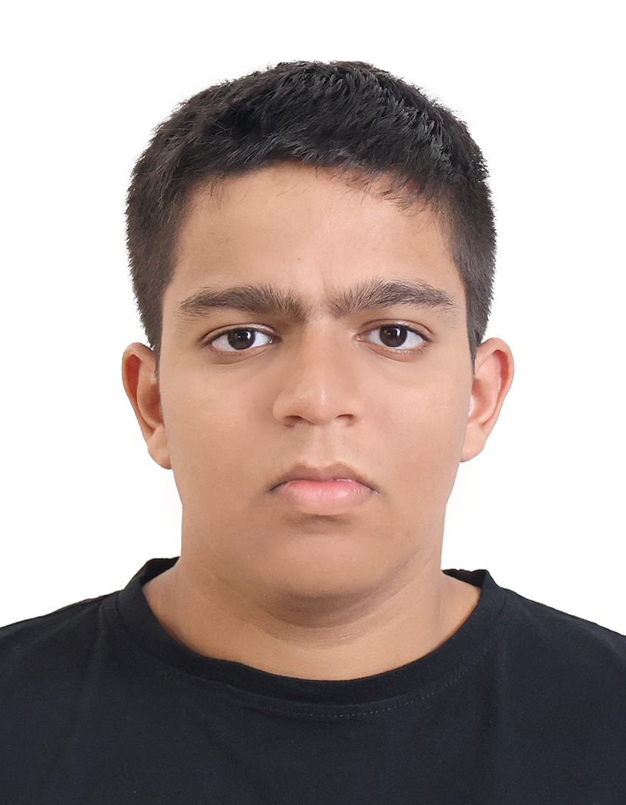
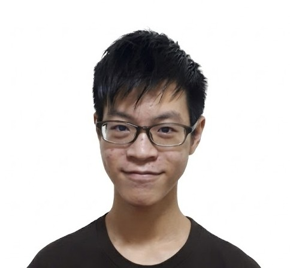

# About Us 🧑‍💼

We are a team based in the [School of Computing, National University of Singapore](http://www.comp.nus.edu.sg).

You can reach us at the email `seer@comp.nus.edu.sg`

---

## Project Team

### SUN HEQIAO

[[github](https://github.com/sun-heqiao)]
[[portfolio](team/sun-heqiao.md)]

* Role: Project Manager
* Responsibilities: Coordinate development tasks, set timelines, track progress, and ensure the project meets the functional and non-functional requirements.

### ZHOU JINGBIN

[[github](http://github.com/jimai1228)]
[[portfolio](team/zhou_jingbin)]

* Role: Frontend Developer
* Responsibilities: Enhance the user interface, improve command input and display layouts, implement visual improvements, and ensure a smooth user experience.

### ISAAC ABRAHAM

[[github](http://github.com/Hack-Zac)]
[[portfolio](team/hack-zac.md)]

* Role: Backend Developer
* Responsibilities: Improve the logic for managing gym member contacts, fix bugs in data handling, optimize performance, and handle storage and persistence of member data.

### JASHER LIM

[[github](http://github.com/jlm012)]
[[portfolio](team/jasher.md)]

* Role: Fullstack Developer / Integration Specialist
* Responsibilities: Bridge frontend and backend features, integrate new commands, ensure consistency across modules, and fix cross-component issues.

### SENTHIL VAIBHAVA RAM

[[github](http://github.com/agukaGorilla)]
[[portfolio](team/ram.md)]

* Role: Documentation / Testing Specialist
* Responsibilities: Update user guide and developer documentation, write test cases, perform manual and automated testing, and ensure features work as intended.
