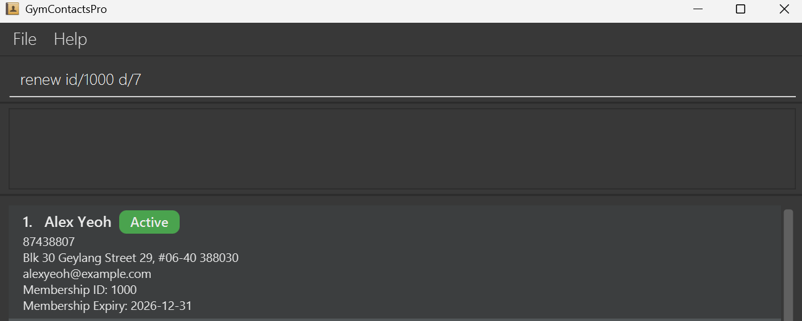

# GymContactsPro User Guide ℹ️

**GymContactsPro** is a desktop application designed for gym managers who prefer **fast, keyboard-driven workflows** to manage and organize member data efficiently.

It combines a **clean visual interface** with **command-based input**, allowing users to perform tasks quickly without relying on menus or mouse interactions.

If you value **speed, accuracy, and efficiency** in your daily operations, GymContactsPro is built for you — download it and get started today!

---

## Table of Contents
- [Quick Start](#quick-start)
- [Features](#features)
  - [Adding a Member: `add`](#adding-a-member-add)
  - [Listing All Members: `list`](#listing-all-members-list)
  - [Deleting Member(s): `delete`](#deleting-member-s-delete)
  - [Editing a Member: `edit`](#editing-a-member-edit)
  - [Finding Member(s): `find`](#finding-member-s-find)
  - [Sorting Members: `sort`](#sorting-members-sort)
  - [Renewing Membership: `renew`](#renewing-membership-renew)
  - [Clearing All Data: `clear`](#clearing-all-data-clear)
  - [Getting Help: `help`](#getting-help-help)
  - [Exiting the App: `exit`](#exiting-the-app-exit)
  - [Saving Data](#saving-data)
- [FAQ](#faq)
- [Known Issues](#known-issues)
- [Command Summary](#command-summary)

--------------------------------------------------------------------------------------------------------------------

## Quick Start

1. Ensure you have Java `17` or above installed in your Computer. 
   **Mac users:** Ensure you have the precise JDK version prescribed [here](https://se-education.org/guides/tutorials/javaInstallationMac.html).

2. Download the latest `.jar` file from [here](https://github.com/se-edu/addressbook-level3/releases).

3. Copy the file to the folder you want to use as the _home folder_ for your AddressBook.

4. Open a command terminal, `cd` into the folder you put the jar file in, and use the `java -jar GymContactsPro.jar` command to run the application. 
   A GUI similar to the below should appear in a few seconds. Note how the app contains some sample data. 
     
Alternatively you could simply double click GymContactsPro.jar file.

5. Type the command in the command box and press Enter to execute it. e.g. typing **`help`** and pressing Enter will open the help window. 
   Some example commands you can try:

  * `list` : Lists all members.

  * `add n/John Doe p/98765432 e/johnd@example.com a/John Street, Block 123, #01-01 138601 m/2026-11-12` : Adds a member named `John Doe` to the list of Registered Members.

  * `find n/John` : Finds members whose names contain "John".

  * * `renew id/1000 d/7` : Renews the membership of the member with ID 1000 by 7 days.

  * `sort n/asc` : Sorts the list of members by name in ascending order.

  * `delete id/1006` : Deletes the member with membership ID 1006 from the list.

  * `clear` : Deletes all members.

  * `exit` : Exits the app.

6. Refer to the [Features](#features) below for details of each command.

--------------------------------------------------------------------------------------------------------------------

## Features

### Before We Begin . . .
<box type="info" seamless>

**These are some notes about the command formats. 
Notes here apply to all features introduced below (where applicable), and will not be repeated**
 

* Words in `UPPER_CASE` are the parameters to be supplied by the user. 
  e.g. in `add n/NAME`, `NAME` is a parameter which can be used as `add n/John Doe`.

* Items in square brackets are optional. 
  e.g `n/NAME [p/PHONE]` can be used as `n/John Doe p/92214584` or as `n/John Doe`.

* Parameters can be in any order. 
  e.g. if the command specifies `n/NAME p/PHONE`, `p/PHONE n/NAME` is also acceptable.

* Extraneous parameters for commands that do not take in parameters (such as `help`, `list`, `exit` and `clear`) will be ignored. 
  e.g. if the command specifies `help 123`, it will be interpreted as `help`.

* If you are using a PDF version of this document, be careful when copying and pasting commands that span multiple lines as space characters surrounding line-breaks may be omitted when copied over to the application.
  </box>

---

### Adding a Member : `add`

Adds a new gym member to the list of registered gym members.

**Format:** `add n/NAME p/PHONE_NUMBER e/EMAIL a/ADDRESS m/EXPIRY_DATE`

<box type="info" seamless>

**Note:**

To ensure data accuracy, the information provided must follow these rules:
* **Name:** Must not be blank.
* **Phone:** Must be exactly 8 digits long and start with 8 or 9.
* **Email:** Must be a properly formatted email address (e.g., `johndoe@example.com`).
* **Address:** Must not be blank and **must end with a valid 6-digit postal code**.
* **Expiry Date:** Must be a valid date in the format `YYYY-MM-DD` and **cannot be before the current date**.

</box>
<box type="tip" seamless>

**Tip:**
* Attributes following the `add` command can be provided in any order
**Tip:**
* Fields following the `add` command can be provided in any order
</box>

**Example input:**
* `add n/Alfred Goh p/88574393 a/Blk 886 Waterloo Street, #03-514, 736886 e/gohfred@gmail.com m/2028-01-01`  

**Example output:**
* Added `Alfred Goh` with his personal details to the list of registered gym members, together with a `New person added: ...` success message.  

---

### Listing All Members : `list`

Displays the list of all registered gym members.

**Format:** `list`

**Example input:**
* `list`  

**Example output:**
* Displays the list of all registered gym members.  

---

### Deleting Member(s) : `delete`

Deletes the specified member(s) from the list of registered gym members.

**Format:** `delete id/MEMBERSHIP_ID [MORE_MEMBERSHIP_IDS]`

<box type="info" seamless>

**Note:**
* Deletes the member(s) with the specified `MEMBERSHIP_ID`(s).
* At least one `MEMBERSHIP_ID` must be provided
* Multiple IDs must be space-separated after `id/`.
* If any `MEMBERSHIP_ID` is invalid, not found or duplicated, no deletions will be performed.
* Deleted members are listed in ascending order of Membership ID in the message box.

</box>

<box type="tip" seamless>

**Tip:**
* You can delete multiple members in one command by providing multiple IDs after `id/`. 
  e.g. `delete id/1000 1001 1002` deletes members with IDs 1000, 1001 and 1002 in one command.

</box>

**Example input:**
* `delete id/1000`  
  

**Example output:**
* Deleted the member(s) with the specified `MEMBERSHIP_ID`(s), together with a `Deleted member(s): ...` success message listing each deleted member.  e.g Deleted person: Alex Yeoh; Phone: 87438807; Email: alexyeoh@example.com; Address: Blk 30 Geylang Street 29, #06-40, 388066; Membership ID: 1000; Membership Expiry Date: 2027-01-15  
  
---

### Editing a Member : `edit`

Edits an existing member among the registered gym members.

**Format:** `edit MEMBERSHIP_ID [n/NAME] [p/PHONE] [e/EMAIL] [a/ADDRESS] [m/EXPIRY_DATE]`

<box type="info" seamless>

**Note:**
* Edits the member at the specified `MEMBERSHIP_ID`.
* At least one of the optional fields must be provided.
* Multiple different fields can be provided at once.
* Existing values will be updated to the input values.Only changed fields will be updated, 
and unchanged fields will remain unchanged.

</box>

<box type="tip" seamless>

**Tip:**
* Fields following the `edit` command can be provided in any order

</box>

**Example input:**
*  `edit 1000 p/91234567 e/johndoe@example.com`  

**Example output:**
* Edited the `PHONE` and `EMAIL` of member with `MEMBERSHIP_ID` of `1000`, together with a `Edited person: ...` success message.  

---

### Finding Member(s) : `find`

Find member(s) matching any of the given keywords.

**Format:** `find PREFIX/KEYWORD [MORE_KEYWORDS]`

<box type="info" seamless>

**Note:**
* Only 1 `PREFIX` is allowed.
    * Prefix `id/` finds by Membership ID.
    * Prefix `n/` finds by Name.
    * Prefix `p/` finds by Phone number.
    * Prefix `e/` finds by Email.
    * Prefix `a/` finds by Address (Postal Code).
    * Prefix `m/` finds by Membership Expiry Date.
* At least 1 `KEYWORD` must be provided.
  * Only full keywords will be matched 
  e.g. `Ber` will not match `Bernice`
  * Keywords are case-insensitive. 
  e.g `BERNICE` will match any members with a name containing `bernice` regardless of capitalization.

</box>

<box type="tip" seamless>

**Tip:**
* Finding by name doesn't require full names.
  * Any keyword matching part of a member’s first or last name will return that member. 
    e.g. `Bernice` will match and find `Bernice Yu`

</box>

**Example input:**
* `find n/bernice`  
  

**Example output:**
* Found `Bernice Yu`, together with a `1 member(s) found` success message.  
  

---

### Sorting Members : `sort`

Sorts the list of registered gym members by the specified order.

**Format:** `sort PREFIX/ORDER` OR `sort none`

<box type="info" seamless>

**Note:**
* Only 1 `PREFIX` is allowed.
  * Prefix `id/` sorts by Membership ID.
  * Prefix `n/` sorts by Name.
  * Prefix `p/` sorts by Phone number.
  * Prefix `e/` sorts by Email.
  * Prefix `a/` sorts by Address (Postal Code).
  * Prefix `m/` sorts by Membership Expiry Date.
* Only 1 `ORDER` can be provided 
  (unless `sort none` is used to disable sorting to return to default order ordering – ascending Membership ID).
  * Order can be either `asc` or `desc` to sort members in ascending or descending order respectively.

</box>

<box type="tip" seamless>

**Tip:**
* Sorting order, regardless of whether it is `asc` or `desc`, will be "turned on" and
applied on displayed lists across all commands unless "turned off" by `sort none`.

</box>

**Example input:**
* `sort n/desc`  
  

**Example output:**
* Sorted `NAME` of members in `desc` order.  
  

---

### Renewing Membership : `renew`

Renews the membership of an existing member.

**Format:** `renew id/MEMBERSHIP_ID d/DAYS`

<box type="info" seamless>

**Note:**
* The `DAYS` parameter specifies the number of days to extend the membership.
* Both `MEMBERSHIP_ID` and `DAYS` parameters are required for the command to be valid.
* If the membership has already expired, the current day is counted as day 1 when renewing. For example, `renew id/1000 d/7` will set the new expiry date to 7 days from today, including today as the first day.
* A maximum of 730 days (2 years) can be added to the current expiry date.

</box>

<box type="tip" seamless>

**Tip:**
* The `DAYS` and `MEMBERSHIP_ID` parameters can be provided in any order.

</box>

**Example input:**
* `renew id/1000 d/7`  
  

**Example output:**
* Renews the membership of member with ID of `1000` by `7` days.  
  

---

### Clearing All Data : `clear`

Deletes all registered gym members after confirmation.

**Format:** `clear`

<box type="info" seamless>

**Note:**
* A warning window will pop up to confirm the deletion of all data.

</box>

<box type="tip" seamless>

**Tip:**
* These are the possible ways to confirm the deletion of all data:
  * Clicking the `Yes` button.
  * Hitting the `Y` key.
* These are the possible ways to cancel the deletion of all data:
  * Clicking the `No` button.
  * Hitting the `N` key.
  * Closing the warning window.

</box>

**Example input:**
* `clear` 

**Example output:**
* A warning window pops up to ask for deletion confirmation.  
  
* After confirmation, all data will be deleted, together with a `All data has been deleted successfully` success message. 
Thereafter, the warning window will close after a short delay.  
  
* If the user decides to cancel the deletion, no data will be deleted and, a `Deletion has been cancelled` success message will be shown instead. 

---

### Getting Help : `help`

Shows a help message.

**Format:** `help`

<box type="info" seamless>

**Note:**
* A help window pops up with the User Guide URL and, a summary of executable commands. 
  The URL can be copied by clicking on the `Copy URL` button. 
  Paste this URL on your preferred internet browser to view the User Guide.  

</box>

<box type="tip" seamless>

**Tip:**
* These are the alternative ways to open the help window:
  * Clicking the `Help F1` button in the `Help` menu.
  * Hitting `Fn+ F1` keys.
* There are two possible ways that to close the help window:
  * Hitting the `esc` key.
  * Closing the help window.

</box>

**Example input:**
* `help` 

**Example output:**
* A help window pops up with the User Guide URL and, a summary of executable commands.  

---

### Exiting the App : `exit`

Exits the app.

**Format:** `exit`

<box type="tip" seamless>

**Tip:**
* These are the alternative ways to exit the app:
  * Clicking the `Exit` button in the `File` menu.
  * Closing the app window.
</box>

**Example input:**
* `exit` 

**Example output:**
* App window gradually disappears from view and the application exits.

---

### Saving Data

Data of all members is saved in the computer's storage automatically after any command that changes member data.
There is no need to save manually.

<box type="info" seamless>

**Note:**
* Data is saved to `[JAR file location]/data/addressbook.json`
* Saving is typically very fast and completes within milliseconds.

</box>

<box type="tip" seamless>

**Tip:**
* It is recommended to regularly back up your `addressbook.json` file to a secure location.

</box>

--------------------------------------------------------------------------------------------------------------------

## FAQ

**Q**: How do I transfer my data to another computer? 
**A**: Install the app in the other computer and overwrite the empty data file it creates with the file that contains the data of your previous AddressBook home folder.

**Q**: What happens if the application freezes or is forcibly closed? 
**A**: If the application freezes (but is not forcefully closed), all your previous changes are safely saved. However, if the application is forcibly closed while saving data (e.g., force quit, system crash, power loss), the data file may become corrupted. In such cases, the application will start with empty member data on the next run. To prevent data loss, it is recommended to regularly back up your `addressbook.json` file.

--------------------------------------------------------------------------------------------------------------------

## Known Issues

1. **When using multiple screens**, if you move the application to a secondary screen, and later switch to using only the primary screen, the GUI will open off-screen. The remedy is to delete the `preferences.json` file created by the application before running the application again.
2. **If you minimize the Help Window** and then run the `help` command (or use the `Help` menu, or the keyboard shortcut `F1`) again, the original Help Window will remain minimized, and no new Help Window will appear. The remedy is to manually restore the minimized Help Window.

--------------------------------------------------------------------------------------------------------------------

## Command Summary

Action     | Format, Examples
-----------|----------------------------------------------------------------------------------------------------------------------------------------------------------------------
**Add**    | `add n/NAME p/PHONE e/EMAIL a/ADDRESS m/EXPIRY_DATE`  e.g., `add n/Alfred Goh p/88574393 a/Blk 886 Waterloo Street, #03-514, 736886 e/gohfred@gmail.com m/2028-01-01`
**List**   | `list`
**Delete** | `delete id/MEMBERSHIP_ID`  e.g., `delete id/1000`
**Edit**   | `edit MEMBERSHIP_ID [n/NAME] [p/PHONE] [e/EMAIL] [a/ADDRESS] [m/EXPIRY_DATE]`  e.g.,`edit 1000 p/91234567 e/johndoe@example.com`
**Find**   | `find PREFIX/KEYWORD [MORE_KEYWORDS]`  e.g., `find n/bernice`
**Sort**   | `sort PREFIX/ORDER` & `sort none`  e.g., `sort n/desc`
**Renew**  | `renew id/MEMBERSHIP_ID d/DAYS`  e.g., `renew id/1000 d/7`
**Clear**  | `clear`
**Help**   | `help`
**Exit**   | `exit`
