# GymContactsPro User Guide ℹ️

**GymContactsPro** is a desktop application designed for gym managers who prefer **fast, keyboard-driven workflows** to manage and organize member data efficiently.

It combines a **clean visual interface** with **command-based input**, allowing users to perform tasks quickly without relying on menus or mouse interactions.

If you value **speed, accuracy, and efficiency** in your daily operations, GymContactsPro is built for you — download it and get started today!

---

## Table of Contents
- [Quick Start](#quick-start)
- [Features](#features)
  - [Adding a Member: `add`](#adding-a-member-add)
  - [Listing All Members: `list`](#listing-all-members-list)
  - [Deleting Member(s): `delete`](#deleting-member-s-delete)
  - [Editing a Member: `edit`](#editing-a-member-edit)
  - [Finding Member(s): `find`](#finding-member-s-find)
  - [Sorting Members: `sort`](#sorting-members-sort)
  - [Clearing All Data: `clear`](#clearing-all-data-clear)
  - [Getting Help: `help`](#getting-help-help)
  - [Exiting the App: `exit`](#exiting-the-app-exit)
  - [Saving Data](#saving-data)
  - [Editing the Data File](#editing-the-data-file)
- [FAQ](#faq)
- [Known Issues](#known-issues)
- [Command Summary](#command-summary)

--------------------------------------------------------------------------------------------------------------------

## Quick Start

1. Ensure you have Java `17` or above installed in your Computer. 
   **Mac users:** Ensure you have the precise JDK version prescribed [here](https://se-education.org/guides/tutorials/javaInstallationMac.html).

2. Download the latest `.jar` file from [here](https://github.com/se-edu/addressbook-level3/releases).

3. Copy the file to the folder you want to use as the _home folder_ for your AddressBook.

4. Open a command terminal, `cd` into the folder you put the jar file in, and use the `java -jar GymContactsPro.jar` command to run the application. 
   A GUI similar to the below should appear in a few seconds. Note how the app contains some sample data. 
   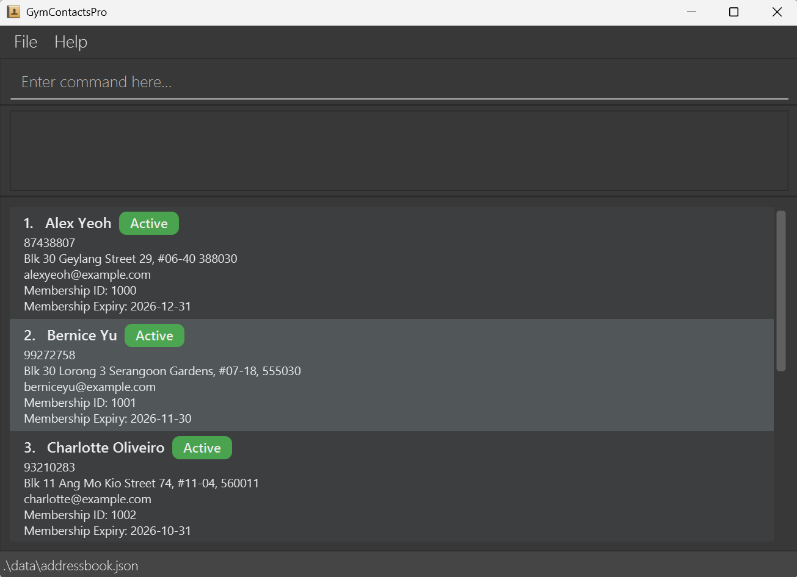  
Alternatively you could simply double click GymContactsPro.jar file.

5. Type the command in the command box and press Enter to execute it. e.g. typing **`help`** and pressing Enter will open the help window. 
   Some example commands you can try:

   * `list` : Lists all contacts.

   * `add n/John Doe p/98765432 e/johnd@example.com a/John street, block 123, #01-01, 138601 m/2026-11-12` : Adds a contact named `John Doe` to the Address Book.

   * `delete 1006` : Deletes the person with membership ID 1006 from the list.

   * `clear` : Deletes all contacts.

   * `exit` : Exits the app.

6. Refer to the [Features](#features) below for details of each command.

--------------------------------------------------------------------------------------------------------------------

## Features

### Before We Begin . . .
<box type="info" seamless>

**These are some notes about the command formats. 
Notes here apply to all features introduced below (where applicable), and will not be repeated**
 

* Words in `UPPER_CASE` are the parameters to be supplied by the user. 
  e.g. in `add n/NAME`, `NAME` is a parameter which can be used as `add n/John Doe`.

* Items in square brackets are optional. 
  e.g `n/NAME [p/PHONE]` can be used as `n/John Doe p/92214584` or as `n/John Doe`.

* Parameters can be in any order. 
  e.g. if the command specifies `n/NAME p/PHONE`, `p/PHONE n/NAME` is also acceptable.

* Extraneous parameters for commands that do not take in parameters (such as `help`, `list`, `exit` and `clear`) will be ignored. 
  e.g. if the command specifies `help 123`, it will be interpreted as `help`.

* If you are using a PDF version of this document, be careful when copying and pasting commands that span multiple lines as space characters surrounding line-breaks may be omitted when copied over to the application.
  </box>

---

### Adding a Member : `add`

Adds a new gym member to the list of registered gym members.

**Format:** `add n/NAME p/PHONE_NUMBER e/EMAIL a/ADDRESS m/EXPIRY_DATE`

<box type="info" seamless>

**Note:**
* Pending edit

</box>
<box type="tip" seamless>

**Tip:** 
* Attributes following the `add` command can be provided in any order
</box>

**Example input:**
* `add n/Alfred Goh p/88574393 a/Blk 886 Waterloo Street, #03-514, 736886 e/gohfred@gmail.com m/2028-01-01`  
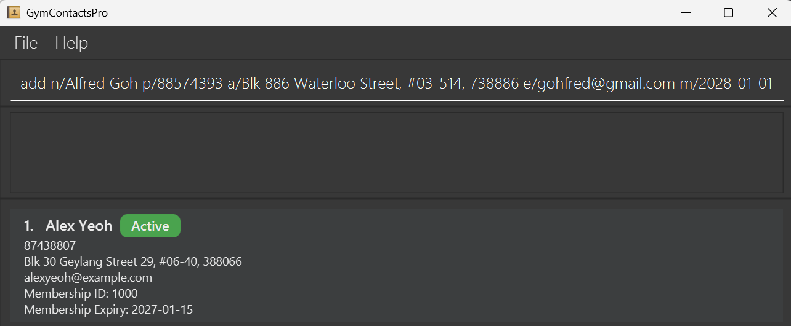
  
**Example output:**
* Added `Alfred Goh` with his personal details to the list of registered gym members, together with a `New person added: ...` success message.  
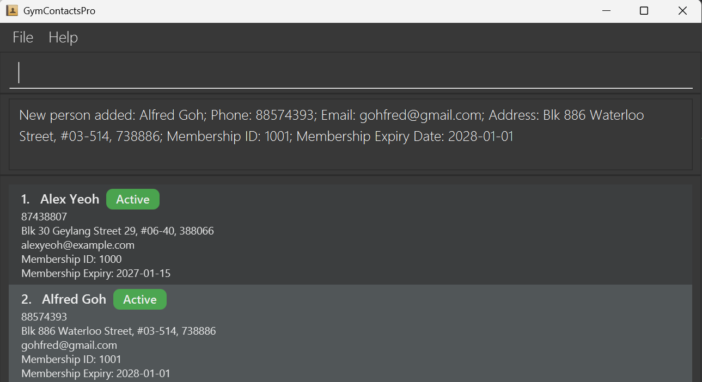

---

### Listing All Members : `list`

Displays the list of all registered gym members.

**Format:** `list`

**Example input:**
* `list`  
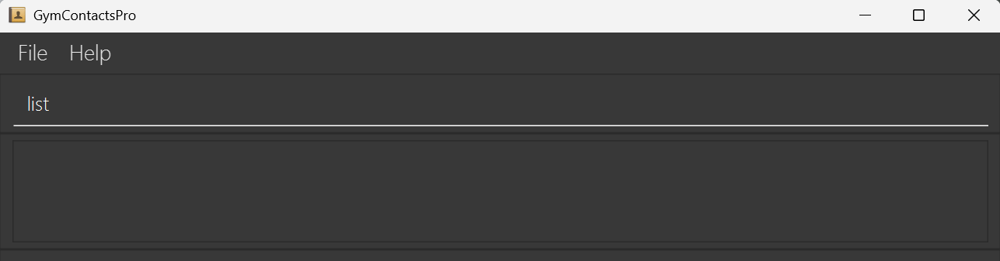

**Example output:**
* Displays the list of all registered gym members.  
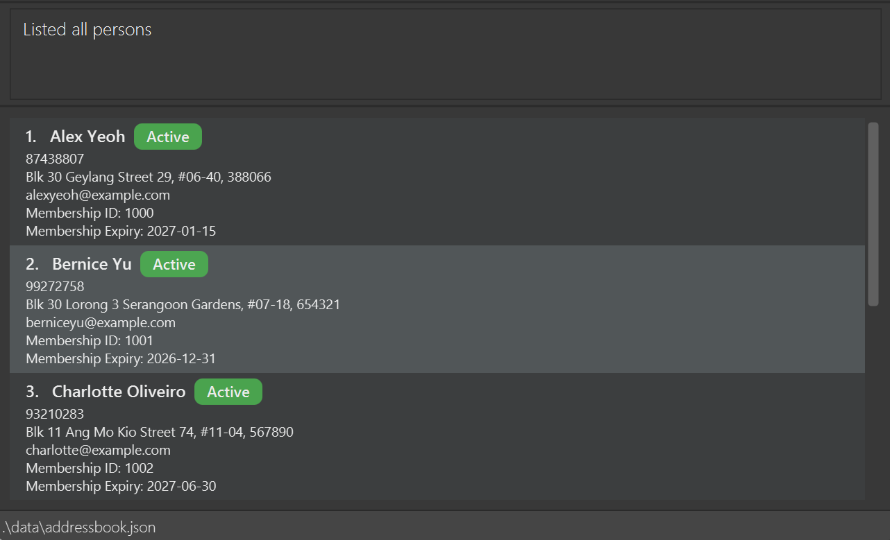

---

### Deleting Member(s) : `delete`

Deletes the specified member(s) from the list of registered gym members.

**Format:** `delete id/MEMBERSHIP_ID [MORE_MEMBERSHIP_IDS]`

<box type="info" seamless>

**Note:**
* Deletes the person with the specified `MEMBERSHIP_ID`.
* The MEMBERSHIP_ID refers to the Membership ID number shown in the displayed person list.

</box>

<box type="tip" seamless>

**Tip:**
* Pending edit

</box>

**Example input:**
* `delete id/1000`  
  

**Example output:**
* Deleted the member with `MEMBERSHIP_ID` of `1000` from the list of registered gym members, together with a `Deleted Person: ...` success message.  
  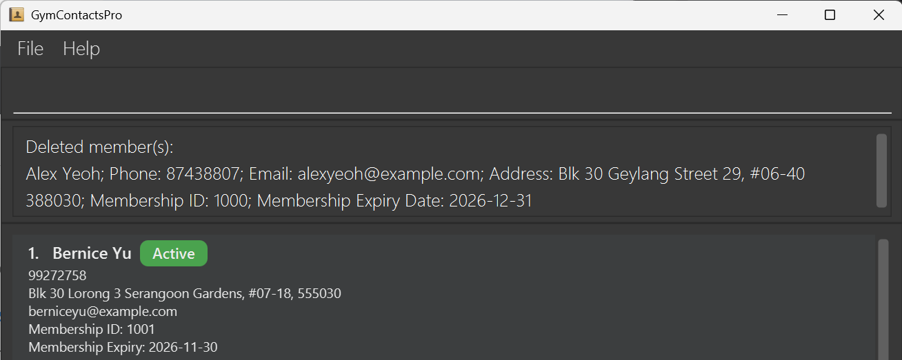

---

### Editing a Member : `edit`

Edits an existing member among the registered gym members.

**Format:** `edit MEMBERSHIP_ID [n/NAME] [p/PHONE] [e/EMAIL] [a/ADDRESS] [m/EXPIRY_DATE]`

<box type="info" seamless>

**Note:**
* Edits the person at the specified `MEMBERSHIP_ID`.
* At least one of the optional fields must be provided.
* Multiple fields can be provided at once. The order of the fields does not matter.
* Existing values will be updated to the input values.

</box>

<box type="tip" seamless>

**Tip:**
* Pending edit

</box>

**Example input:**
*  `edit 1000 p/91234567 e/johndoe@example.com`  
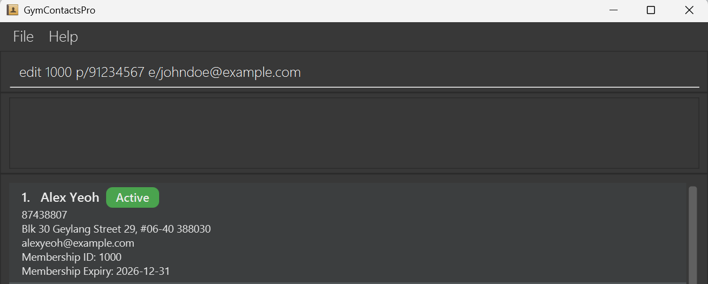

**Example output:**
* Edited the `PHONE` and `EMAIL` of member with `MEMBERSHIP_ID` of `1000`, together with a `Edited person: ...` success message.  
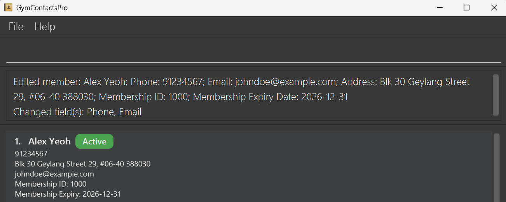

---

### Finding Member(s) : `find`

Finds member(s) matching any of the given keywords.

**Format:** `find PREFIX/KEYWORD [MORE_KEYWORDS]`

<box type="info" seamless>

**Note:** 
* Only 1 `PREFIX` is allowed in the command
    * Prefix `id/` finds by Membership ID.
    * Prefix `n/` finds by Name.
    * Prefix `p/` finds by Phone number.
    * Prefix `e/` finds by Email.
    * Prefix `a/` finds by Address (Postal Code).
    * Prefix `m/` finds by Membership Expiry Date.
* At least 1 `KEYWORD` must be provided.
  * Only full keywords will be matched 
  e.g. `Ber` will not match `Bernice`
  * Keywords are case-insensitive. 
  e.g `bernice` will match `BERNICE`
</box>

<box type="tip" seamless>

**Tip:** 
* Finding by name doesn't require full names.
  * Any keyword matching part of a member’s first or last name will return that member. 
    e.g. `Bernice` will match and find `Bernice Yu`

</box>

**Example input:**
* `find n/bernice`  
  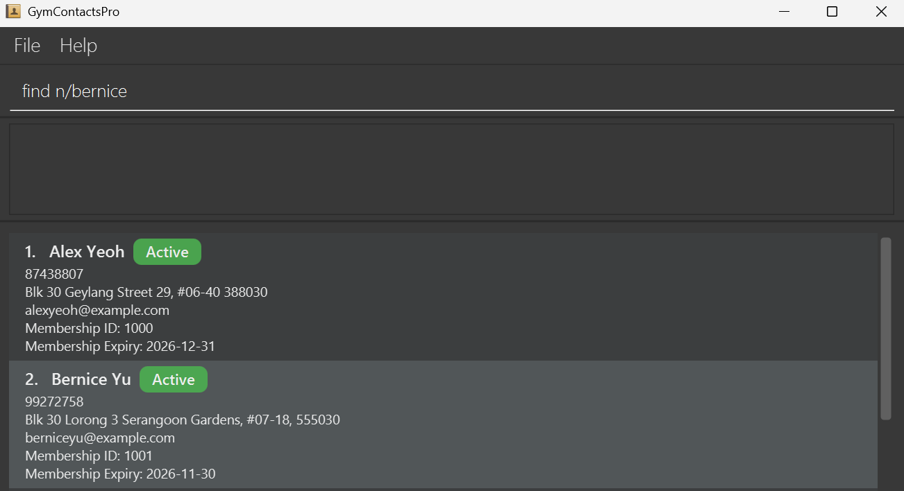

**Example output:**
* Found `Bernice Yu`, together with a `(No. of) persons listed` success message.  
  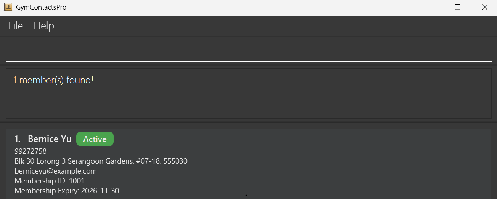

---

### Sorting Members : `sort`

Sorts the list of registered gym members by the specified order.

**Format:** `sort PREFIX/ORDER` OR `sort none`

<box type="info" seamless>

**Note:**
* Only 1 `PREFIX` is allowed in the command
  * Prefix `id/` sorts by Membership ID.
  * Prefix `n/` sorts by Name.
  * Prefix `p/` sorts by Phone number.
  * Prefix `e/` sorts by Email.
  * Prefix `a/` sorts by Address (Postal Code).
  * Prefix `m/` sorts by Membership Expiry Date.
* Only 1 `ORDER` can be provided 
  (unless `sort none` is used to disable sorting).
  * Order can be either `asc` or `desc` to sort members in ascending or descending order respectively.
  * Order is case-insensitive.

</box>

<box type="tip" seamless>

**Tip:** 
* Sorting order, regardless of whether it is `asc` or `desc`, will be "turned on" and
applied on displayed lists across all commands unless "turned off" by `sort none`.

</box>

**Example input:**
* `sort n/desc`  
  

**Example output:**
* Sorted `NAME` of members in `desc` order.  
  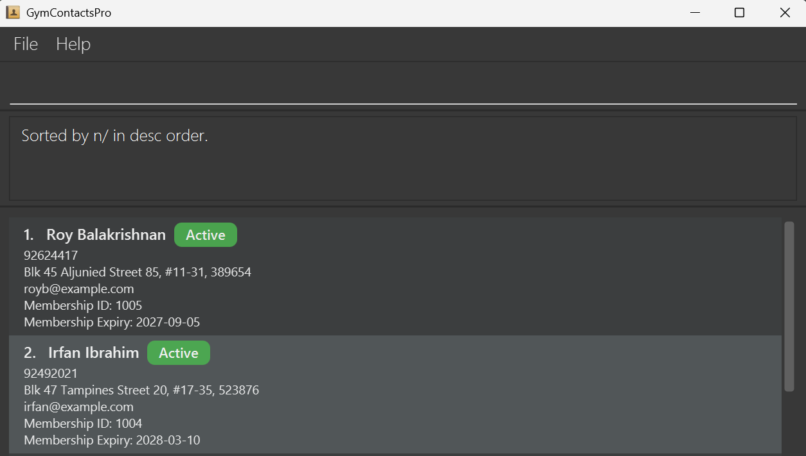

---

### Clearing All Data : `clear`

Delete all registered gym members after confirmation.

**Format:** `clear`

<box type="info" seamless>

**Note:**
* A warning page will pop up to confirm the deletion of all data.

</box>

<box type="tip" seamless>

**Tip:**
* These are the possible ways to confirm the deletion of all data:
  * Clicking the `Yes` button.
  * Hitting the `Y` key.
* These are the possible ways to cancel the deletion of all data:
  * Clicking the `No` button.
  * Hitting the `N` key.

</box>

**Example input:**
* `clear`  
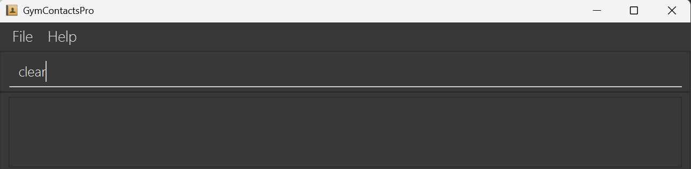

**Example output:**
* A warning window pops up to ask for confirmation.  
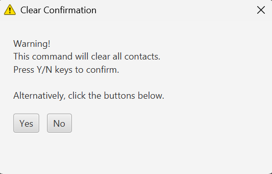  
* After confirmation, all data will be deleted, together with a `All data has been deleted successfully` success message. 
The warning window will close after a short delay.  
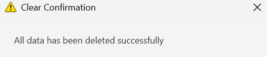

---

### Getting Help : `help`

Shows a help message.

**Format:** `help`

<box type="info" seamless>

**Note:**
* Pending edit

</box>

<box type="tip" seamless>

**Tip:**
* Pending edit

</box>

**Example input:**
* `help`  

**Example output:**
* A help window pops up with the User Guide URL and, a summary of executable commands.  
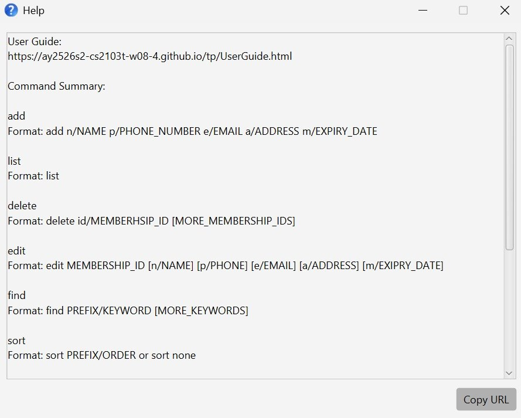

---

### Exiting the App : `exit`

Exits the app.

**Format:** `exit`

<box type="info" seamless>

**Note:**
* Pending edit

</box>

<box type="tip" seamless>

**Tip:**
* Pending edit

</box>

**Example input:**
* `exit`  
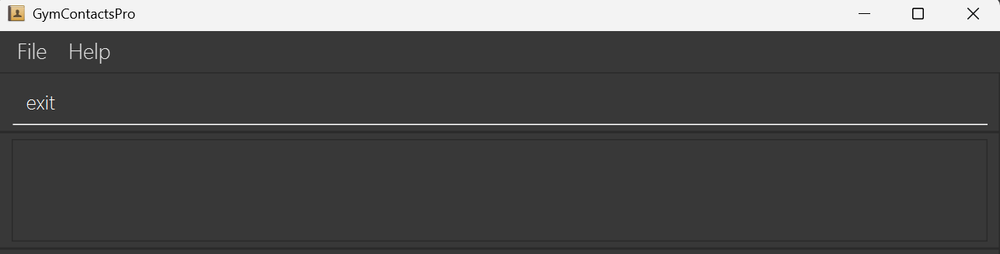

**Example output:**
* App window gradually disappears from view and the application exits.

---

### Saving Data

AddressBook data are saved in the hard disk automatically after any command that changes the data. There is no need to save manually.

---

### Editing the Data File

AddressBook data are saved automatically as a JSON file `[JAR file location]/data/addressbook.json`. Advanced users are welcome to update data directly by editing that data file.

<box type="warning" seamless>

**Caution:**
If your changes to the data file makes its format invalid, AddressBook will discard all data and start with an empty data file at the next run.  Hence, it is recommended to take a backup of the file before editing it. 
Furthermore, certain edits can cause the AddressBook to behave in unexpected ways (e.g., if a value entered is outside the acceptable range). Therefore, edit the data file only if you are confident that you can update it correctly.
</box>

--------------------------------------------------------------------------------------------------------------------

## FAQ

**Q**: How do I transfer my data to another Computer? 
**A**: Install the app in the other computer and overwrite the empty data file it creates with the file that contains the data of your previous AddressBook home folder.

--------------------------------------------------------------------------------------------------------------------

## Known Issues

1. **When using multiple screens**, if you move the application to a secondary screen, and later switch to using only the primary screen, the GUI will open off-screen. The remedy is to delete the `preferences.json` file created by the application before running the application again.
2. **If you minimize the Help Window** and then run the `help` command (or use the `Help` menu, or the keyboard shortcut `F1`) again, the original Help Window will remain minimized, and no new Help Window will appear. The remedy is to manually restore the minimized Help Window.

--------------------------------------------------------------------------------------------------------------------

## Command Summary

Action     | Format, Examples
-----------|----------------------------------------------------------------------------------------------------------------------------------------------------------------------
**Add**    | `add n/NAME p/PHONE e/EMAIL a/ADDRESS m/EXPIRY_DATE`  e.g., `add n/James Ho p/92375927 e/jamesho@example.com a/Blk 123, Clementi Rd, 665123 m/2026-12-31`
**List**   | `list`
**Delete** | `delete id/MEMBERSHIP_ID`  e.g., `delete id/1021`
**Edit**   | `edit id/MEMBERSHIP_ID [n/NAME] [p/PHONE] [e/EMAIL] [a/ADDRESS] [m/EXPIRY_DATE]`  e.g.,`edit 1016 n/James Lee e/jameslee@example.com`
**Find**   | `find PREFIX/KEYWORD [MORE_KEYWORDS]`  e.g., `find n/James Max`
**Sort**   | `sort PREFIX/ORDER `  e.g., `sort n/desc`  or   e.g., `sort none`
**Clear**  | `clear`
**Help**   | `help`
**Exit**   | `exit`
