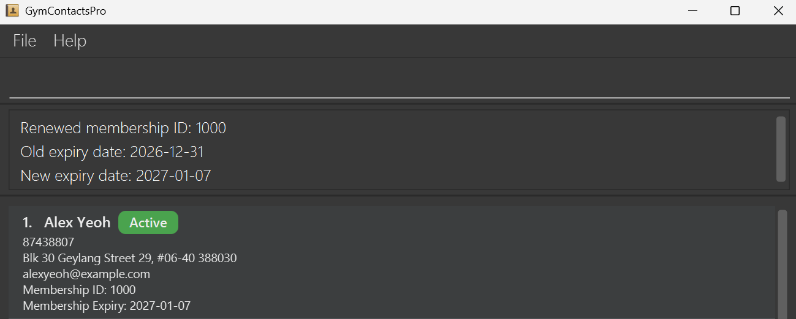
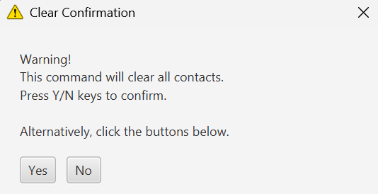

# GymContactsPro User Guide ℹ️

**GymContactsPro** is a desktop application designed for gym managers who prefer **fast, keyboard-driven workflows** to manage and organize member data efficiently.

It combines a **clean visual interface** with **command-based input**, allowing users to perform tasks quickly without relying on menus or mouse interactions.

If you value **speed, accuracy, and efficiency** in your daily operations, GymContactsPro is built for you — download it and get started today!

---
<br>

## Table of Contents
- [Quick Start](#quick-start)
- [Features](#features)
  - [Adding a Member: `add`](#adding-a-member-add)
  - [Listing All Members: `list`](#listing-all-members-list)
  - [Deleting Member(s): `delete`](#deleting-member-s-delete)
  - [Editing a Member: `edit`](#editing-a-member-edit)
  - [Finding Member(s): `find`](#finding-member-s-find)
  - [Sorting Members: `sort`](#sorting-members-sort)
  - [Renewing Membership: `renew`](#renewing-membership-renew)
  - [Clearing All Data: `clear`](#clearing-all-data-clear)
  - [Getting Help: `help`](#getting-help-help)
  - [Exiting the App: `exit`](#exiting-the-app-exit)
  - [Saving Data](#saving-data)
- [FAQ](#faq)
- [Known Issues](#known-issues)
- [Command Summary](#command-summary)

<div style="page-break-after: always;"></div>

--------------------------------------------------------------------------------------------------------------------
<br>

## Quick Start

1. Ensure you have Java `17` or above installed in your computer.<br>
    * Full guide for installation [here](https://se-education.org/guides/tutorials/javaInstallation.html). If you are familiar with the process, you can download Java directly [here](https://www.oracle.com/asean/java/technologies/downloads/).<br>
      **Mac users:** Ensure you have the precise JDK version prescribed [here](https://se-education.org/guides/tutorials/javaInstallationMac.html).<br><br>


2. Download the latest `.jar` file from [here](https://github.com/AY2526S2-CS2103T-W08-4/tp/releases).
   * The folder containing the downloaded `GymContactsPro.jar` is your _home folder_ for GymContactsPro.
   * For the best experience, move the `GymContactsPro.jar` file to a dedicated and easily accessible folder, such as: <br>
   **Windows:** `Documents\GymContactsPro` <br>
   **macOS:** `~/Documents/GymContactsPro` <br>
   **Linux:** `~/Documents/GymContactsPro` 
   <br><br>

3. On your respective Operating System (OS), open a terminal to launch GymContactsPro.

   <tabs>
      <tab header="Windows">

   Open **Command Prompt** or **PowerShell** and run:

      ```bash
      cd PATH_TO_HOME_FOLDER
      java -jar GymContactsPro.jar
      ```

      <box type="info" seamless>

   PATH_TO_HOME_FOLDER is the path to the folder where you placed the `GymContactsPro.jar` file in. If your _home folder_
   was your `Downloads\GymContactsPro` folder, the command would be `cd C:\Users\<YOUR_USERNAME>\Downloads\GymContactsPro`

      </box>

      </tab>
      <tab header="Mac">

   Open **Terminal** and run:

      ```bash
      cd PATH_TO_HOME_FOLDER
      java -jar GymContactsPro.jar
      ```

      <box type="info" seamless>

   PATH_TO_HOME_FOLDER is the path to the folder where you placed the `GymContactsPro.jar` file in. If your _home folder_
   was your `Downloads/GymContactsPro` folder, the command would be `cd ~/Downloads/GymContactsPro`

      </box>

      </tab>
      <tab header="Linux">

   Open **Terminal** and run:

      ```bash
      cd PATH_TO_HOME_FOLDER
      java -jar GymContactsPro.jar
      ```

      <box type="info" seamless>

   PATH_TO_HOME_FOLDER is the path to the folder where you placed the `GymContactsPro.jar` file in. If your _home folder_
   was your `Downloads/GymContactsPro` folder, the command would be `cd ~/Downloads/GymContactsPro`

      </box>

      </tab>
   </tabs>

   An interface shown below should appear in a few seconds. The app comes preloaded with some sample data.<br><br>
    <br>

4. Alternatively you could simply double-click the `GymContactsPro.jar` file.<br>

5. Type a command in the command box and press Enter to execute it.<br>
e.g. typing `help` and pressing Enter will open the help window.<br> 

6. Refer to the [Features](#features) below for more commands to try.

<div style="page-break-after: always;"></div>

--------------------------------------------------------------------------------------------------------------------

<br>

## Features

### Before We Begin . . .
<box type="info" seamless>

**Notes here apply to all features introduced below (unless otherwise specified)**
<br>

* Words in `UPPER_CASE` are the fields whose values are to be supplied by the user.<br>
  e.g. in `add n/NAME`, `NAME` is a field which can be used as `add n/John Doe`.

* Items in square brackets are optional.<br>
  e.g `n/NAME [p/PHONE]` can be used as `n/John Doe p/92214584` or as `n/John Doe`.

* Fields can be in any order.<br>
  e.g. if the command specifies `n/NAME p/PHONE`, `p/PHONE n/NAME` is also acceptable.

* Commands can be typed in any capitalization.<br>
  e.g. `sort n/desc` and `SORT N/DESC` are acceptable.

* Fields can be typed in any capitalization and will be shown as it is.<br>
  e.g. `add n/MASON ...` will save the new member with the capitalized name `MASON`

* Extraneous characters for commands that do not take in fields (such as `help`, `list`, `exit` and `clear`) will be ignored.<br>
  e.g. if the command specifies `help 123`, it will be interpreted as `help`.

* Rules for the fields are:
  * `MEMBERSHIP_ID`: Must be a 4-digit number from `1000` to `9999`
  * `NAME`: Must be non-empty.
  * `PHONE`: Must be exactly 8 digits long and start with 8 or 9.
  * `EMAIL`: Must be a properly formatted email address (e.g. `johndoe@example.com`).
  * `ADDRESS`: Must end with a valid 6-digit postal code.
  * `EXPIRY_DATE`: Must be a valid date in the format `YYYY-MM-DD` and, cannot be before the current date.
<br><br>
* If you are using a PDF version of this document, be careful when copying and pasting commands that span multiple lines as space characters surrounding line-breaks may be omitted when copied over to the application.
  </box>

---
<br>

### Adding a Member : `add`

Adds a new gym member to the list of registered gym members.

**Format:** `add n/NAME p/PHONE e/EMAIL a/ADDRESS m/EXPIRY_DATE`

<box type="info" seamless>

**Note:**
* All five fields are required: `NAME`, `PHONE`, `EMAIL`, `ADDRESS`, `EXPIRY_DATE`<br><br>
* Duplicate members (based on `PHONE` or `EMAIL`) cannot be added.

</box>

<box type="tip" seamless>

**Tip:**
* You don't need to worry about Membership IDs; they're automatically generated, always increasing, and never reuse old IDs from deleted members.

</box>

**Example input:**
```
add n/Alfred Goh p/88574393 a/Blk 886 Waterloo Street, #03-514, 736886 e/gohfred@gmail.com m/2028-01-01
```

**Expected output:**
* Added `Alfred Goh` with his personal details to the list of registered gym members, together with a `New member added: ...` success message.<br><br>


---
<br>

### Listing All Members : `list`

Displays the list of all registered gym members.

**Format:** `list`

---
<br>

### Deleting Member(s) : `delete`

Deletes the specified member(s) from the list of registered gym members.

**Format:** `delete id/MEMBERSHIP_ID [MORE_MEMBERSHIP_IDS]`

<box type="info" seamless>

**Note:**
* `MEMBERSHIP_ID` specifies the membership ID of the member to be deleted.
  * At least one membership ID must be provided.
<br><br>
* If any `MEMBERSHIP_ID` is invalid, not found or duplicated, no deletions will be performed.
<br><br>
* Deleted members will be listed in ascending order of Membership ID in the message box.

</box>

<box type="tip" seamless>

**Tip:**
* Delete multiple members at once by providing multiple membership IDs after `id/`<br>
  e.g. `delete id/1000 1001 1002` deletes members with membership IDs 1000, 1001 and 1002 in one command.

</box>

**Example input:**
```
delete id/1000
```

**Expected output:**
* Deleted the member with the specified `MEMBERSHIP_ID` of `1000`, together with a `Deleted member(s): ...` success message.<br><br>
  
---
<br>

### Editing a Member : `edit`

Edits an existing gym member among the registered gym members.

**Format:** `edit MEMBERSHIP_ID [n/NAME] [p/PHONE] [e/EMAIL] [a/ADDRESS] [m/EXPIRY_DATE]`

<box type="info" seamless>

**Note:**
* `MEMBERSHIP_ID` specifies the membership ID of the member to be edited.
  * The membership ID must be provided before the optional fields.
  * The membership ID cannot be edited and, editing other fields will not change the membership ID.
<br><br>
* At least one of the optional fields in `[square brackets]` must be provided.
<br><br>
* Existing values will be updated with the provided values. 
  * If some of the provided fields are identical to the original values, those values will remain unchanged.
  * If all of the provided values are identical to original values, no edits will be performed.<br><br>
* Editing members to create duplicates (based on `PHONE` or `EMAIL` or both) is not allowed.

</box>

<box type="tip" seamless>

**Note:**
* Edit multiple fields at once by providing multiple fields after `MEMBERSHIP_ID` <br>
  e.g. `edit 1000 p/91234567 e/johndoe@example.com` edits the `PHONE` and `EMAIL` of member with `MEMBERSHIP_ID` of `1000` in one command.

</box>


**Example input:**
```
edit 1000 p/91234567 e/johndoe@example.com
```

**Expected output:**
* Edited the `PHONE` and `EMAIL` of member with `MEMBERSHIP_ID` of `1000`, together with a `Edited member: ...` success message.<br><br>


---
<br>

### Finding Member(s) : `find`

Find gym member(s) matching any of the given keywords.

**Format:** `find PREFIX/KEYWORD [MORE_KEYWORDS]`

<box type="info" seamless>

**Note:**
* Only 1 `PREFIX` is allowed.
    * Prefix `id/` finds by Membership ID.
    * Prefix `n/` finds by Name.
    * Prefix `p/` finds by Phone number.
    * Prefix `e/` finds by Email.
    * Prefix `a/` finds by Address (Postal Code).
    * Prefix `m/` finds by Membership Expiry Date. <br><br>
* At least 1 `KEYWORD` must be provided.
  * Only full keywords will be matched<br>
  e.g. `Ber` will not match `Bernice`
  * Keywords are case-insensitive.<br>
  e.g. `BERNICE` will match any members with a name containing `bernice` regardless of capitalization.
  * Only enter postal code when finding by address.

</box>

<box type="tip" seamless>

**Tip:**
* When finding by name `n/`, you can use either the first or last name as keywords. 
  * For example, if the member's name is `Bernice Yu`, searching for `n/Bernice` will find `Bernice Yu`. Similarly, searching for `n/Yu` will also find `Bernice Yu`.

</box>

**Example input:**
```
find n/bernice
```

**Expected output:**
* Found `Bernice Yu`, together with a `1 member(s) found` success message.<br><br>
  

---
<br>

### Sorting Members : `sort`

Sorts the list of registered gym members by the specified order.

**Format:** `sort PREFIX/ORDER` OR `sort none`

<box type="info" seamless>

**Note:**
* Only 1 `PREFIX` is allowed.
  * Prefix `id/` sorts by Membership ID.
  * Prefix `n/` sorts by Name.
  * Prefix `p/` sorts by Phone number.
  * Prefix `e/` sorts by Email.
  * Prefix `a/` sorts by Address (Postal Code).
  * Prefix `m/` sorts by Membership Expiry Date.<br><br>
* Only 1 `ORDER` can be provided<br>
  (unless `sort none` is used to disable sorting to return to default order ordering – ascending Membership ID).
  * Order can be either `asc` or `desc` to sort members in ascending or descending order respectively. <br><br>
* Sorting order, regardless of whether it is `asc` or `desc`, will be "turned on" and
  applied on displayed lists across all commands unless "turned off" by `sort none`<br><br>
* When multiple members have the same value for the chosen sorting field (e.g. two members with the name `Alice`), their Membership ID will be used as a secondary sorting criterion.

</box>

<box type="tip" seamless>

**Tip:**
* Sort by `sort m/asc` to find out which members have to renew their memberships soon.

</box>

**Example input:**
```
sort n/desc
```

**Expected output:**
* Sorted `NAME` of members in descending order.<br><br>
  

---
<br>

### Renewing Membership : `renew`

Renews the membership expiry date of an existing gym member.

**Format:** `renew id/MEMBERSHIP_ID d/DAYS`

<box type="info" seamless>

**Note:**
* Both `MEMBERSHIP_ID` and `DAYS` fields are required for the command to be valid.<br><br>
* `MEMBERSHIP_ID` specifies the membership ID of the member to be renewed.<br><br>
* `DAYS` specifies the number of days to extend the membership expiry date by and, it must be a number between `1` and `730` (2 years).
    * If the membership has already expired, the current day is counted as day 1 when renewing.<br>
    e.g. `renew id/1000 d/7` will set the new expiry date to 7 days from today, including today as the first day.
    * If the membership is still valid, the new expiry date is calculated from the current expiry date.
<br><br>
* Renewing a member's membership will not change the membership ID of the member.
</box>

**Example input:**
```
renew id/1000 d/7
```

**Expected output:**
* Renews the membership expiry date of member with membership ID of `1000` by `7` days.<br><br>
  

---
<br>

### Clearing All Data : `clear`

Deletes all registered gym members after confirmation.

**Format:** `clear`

<box type="info" seamless>

**Note:**
* A warning window will pop up to confirm the deletion of all data. 
<br><br>
* To confirm the deletion:
    * Click the `Yes` button. <br>
    * Press the `Y` key. <br><br>
* To cancel the deletion:
    * Click the `No` button. <br>
    * Press the `N` key. <br>
    * Close the warning window.
</box>

**Expected output:**
* A warning window pops up to ask for deletion confirmation.<br><br>
  <br><br>
* After confirmation, all data will be deleted, together with a `All data has been deleted successfully` success message.<br>
* If the user decides to cancel the deletion, no data will be deleted and, a `Deletion has been cancelled` success message will be shown instead.<br>

---
<br>

### Getting Help : `help`

Shows a help window containing the URL of the User Guide and a summary of executable commands.

**Format:** `help`

<box type="tip" seamless>

**Tip:**
* Alternative ways to open the help window:
  * Clicking the `Help F1` button in the `Help` menu.
  * Pressing the `Fn + F1` keys.
<br><br>
* Alternative ways to close the help window:
    * Pressing the `esc` key.
    * Closing the window.
</box>

**Expected output:**
<br><br>


---
<br>

### Exiting the App : `exit`

Exits the app.

**Format:** `exit`

<box type="tip" seamless>

**Tip:**
* Alternative ways to exit the app:
    * Clicking the `Exit` button in the `File` menu.
    * Closing the app window.
</box>

---
<br>

### Saving Data

Data of all members is saved in the computer's storage automatically after any command that changes member data.
There is no need to save manually.

<box type="info" seamless>

**Note:**
* Data is saved to `[JAR file location]/data/addressbook.json`
<br><br>
* Saving is typically very fast and completes within milliseconds.

</box>

<box type="tip" seamless>

**Tip:**
* It is recommended to regularly back up your `addressbook.json` file to a secure location.

</box>

<div style="page-break-after: always;"></div>

--------------------------------------------------------------------------------------------------------------------

## FAQ

**Q**: How do I transfer my data to another computer?<br>
**A**: Install the app on the new computer, then move the `data` folder from the home folder of `GymContactsPro.jar` on your previous computer to the home folder of `GymContactsPro.jar` on the new computer.

**Q**: What happens if the application freezes or is forcibly closed?<br>
**A**: If the application freezes (but is not forcefully closed), all your previous changes are safely saved. However, if the application is forcibly closed while saving data (e.g., force quit, system crash, power loss), the data file may become corrupted. In such cases, the application will start with empty member data on the next run. To prevent data loss, it is recommended to regularly back up your `addressbook.json` file.

**Q**: Why am I getting a permission error when trying to run the app on Linux?<br>
**A**: If you get a permission error, you should make the file executable. Try typing in the terminal: `chmod +x GymContactsPro.jar`

--------------------------------------------------------------------------------------------------------------------

## Known Issues

1. **When using multiple screens**, if you move the application to a secondary screen, and later switch to using only the primary screen, the GUI will open off-screen. The remedy is to delete the `preferences.json` file created by the application before running the application again.
   * The `preferences.json` file is located in the home folder of `GymContactsPro.jar`

--------------------------------------------------------------------------------------------------------------------

## Command Summary

Action     | Format, Examples
-----------|----------------------------------------------------------------------------------------------------------------------------------------------------------------------
**Add**    | `add n/NAME p/PHONE e/EMAIL a/ADDRESS m/EXPIRY_DATE`<br> e.g., `add n/Alfred Goh p/88574393 a/Blk 886 Waterloo Street, #03-514, 736886 e/gohfred@gmail.com m/2028-01-01`
**List**   | `list`
**Delete** | `delete id/MEMBERSHIP_ID [MORE_MEMBERSHIP_IDS]`<br> e.g., `delete id/1000`
**Edit**   | `edit MEMBERSHIP_ID [n/NAME] [p/PHONE] [e/EMAIL] [a/ADDRESS] [m/EXPIRY_DATE]`<br> e.g.,`edit 1000 p/91234567 e/johndoe@example.com`
**Find**   | `find PREFIX/KEYWORD [MORE_KEYWORDS]`<br> e.g., `find n/bernice`
**Sort**   | `sort PREFIX/ORDER` OR `sort none`<br> e.g., `sort n/desc`
**Renew**  | `renew id/MEMBERSHIP_ID d/DAYS`<br> e.g., `renew id/1000 d/7`
**Clear**  | `clear`
**Help**   | `help`
**Exit**   | `exit`
